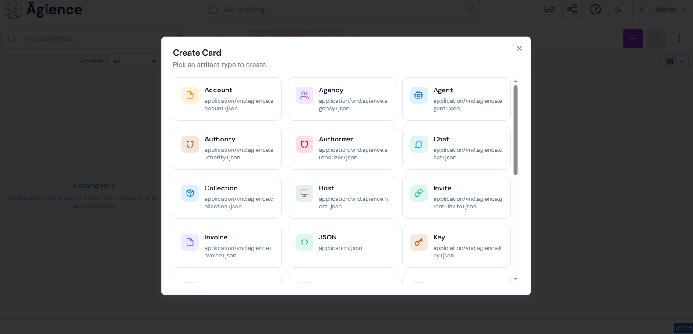
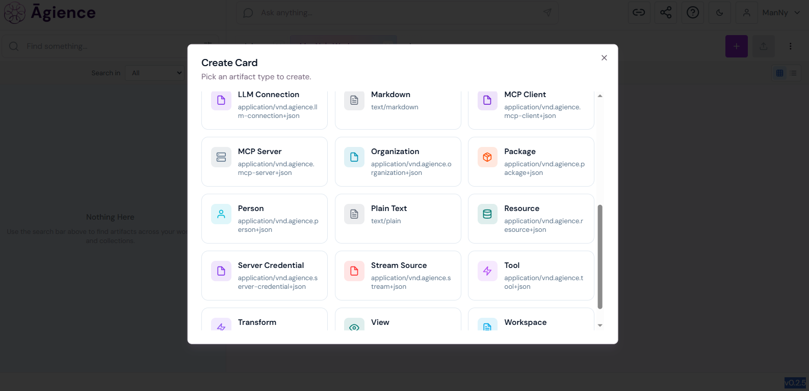

# Design Brief — Agience FLARE × DKG v10 Integration

**Package:** `agience-flare-dkg-integration`  
**Bounty tag:** `cfi-dkgv10-r1`  
**Maintainer:** Manoj Modhwadia ([@Muffinman75](https://github.com/Muffinman75)) — manojmodhwadia@outlook.com  
**Tier target:** Flagship (8,000–10,000 TRAC)

---

## 1. Problem

Long-horizon research and knowledge-producing agents generate durable artifacts — decisions, claims, research notes, citations, summaries — but most current stacks trap them in local tools, transient chats, or private retrieval systems with no provenance, no trust gradient, and no path to collaborative verification.

DKG v10 introduces the three-tier memory model (Working Memory → Shared Memory → Verifiable Memory) that can serve as that shared substrate. But to be genuinely useful, it needs two things upstream:

1. A **governed authoring layer** that produces clean, typed, attributed Knowledge Assets — not raw LLM outputs.
2. A **confidential retrieval layer** that mediates what content reaches the shared substrate when the source material is sensitive.

This submission bridges three systems at the architectural level to provide both:

- **[Agience Core](https://github.com/Agience/agience-core)** — an MCP-native AI knowledge platform (7 agent persona MCP servers exposing 100+ tools, pluggable LLM providers — OpenAI, Anthropic, Azure OpenAI, Google AI, Cohere, Mistral, or local Ollama — ArangoDB + OpenSearch) with governed artifact authoring, versioned collections, human-review commit boundaries, and provenance receipts. DKG projection models, receipt schemas, and policy routing have been added directly to the Agience Core platform as part of this integration.

- **[FLARE](https://github.com/Agience/flare-index)** ([paper](https://github.com/Agience/flare-index/blob/main/paper/flare.md)) — cryptographically enforced AES-256-GCM encrypted vector search with Shamir K-of-M threshold oracle key issuance, Ed25519 signed hash-chained grant ledger, and light-cone graph authorization. 101-test pytest suite; 95.6% recall preservation vs plaintext FAISS on BEIR SciFact. FLARE mediates the retrieval path — when content is classified as confidential, only derived projections reach DKG.

- **DKG v10** — Working Memory, Shared Memory, and Verifiable Memory as the open, verifiable, collaborative memory substrate.

**Why this matters now.** As of 7 May 2026, OriginTrail shipped `dkg mcp setup` — a two-command path that wires any MCP-compatible client (Cursor, Claude Desktop, Claude Code, Cline, Codex, Windsurf, VS Code Copilot Chat) to DKG Working Memory. That's the new floor, and it solves *transport*. It does not solve *governance*: there is no human-review commit boundary, no policy-controlled projection, no cryptographic confidentiality boundary, and no typed RDF vocabulary above raw `dkg-create` calls. This integration delivers exactly that upstream governance, so what reaches the shared substrate is signal, not noise. The head-to-head comparison is in §2 below and in [`docs/vs-dkg-mcp-setup.md`](docs/vs-dkg-mcp-setup.md).

**Positioning.** This submission is **platform-level and complementary** to single-tool integrations. A ChatGPT, Claude, Slack, GitHub, Obsidian, OpenClaw, or Hermes agent can write into a governed Agience workspace via Agience's persona MCP servers; this integration then governs which artifacts reach DKG Working Memory and Shared Memory, with what typing, and under whose authority. OpenClaw and Hermes are MCP-capable and can call `agience_wm_write` directly — the integration is not tied to any one agent framework. The intent is to strengthen the ecosystem alongside other Round 1 entries, not to overlap with them.

---

## 2. Why This Is a Flagship-Level Submission

The official `dkg mcp setup` makes MCP transport to DKG a commodity. This submission is structurally different — it is the governance layer above the commodity floor:

| Capability | `dkg mcp setup` (the new floor) | This integration |
|---|---|---|
| **MCP transport to DKG** | ✅ Two-command install for any MCP host | ✅ MCP stdio server (compatible, complementary) |
| **Human-review commit boundary** | ❌ Direct `dkg-create` from any agent | ✅ Workspace → Collection commit gate; nothing reaches DKG without explicit approval |
| **Structured commit review** | ❌ No review surface — every `dkg-create` lands directly | ✅ `CommitReviewDialog` shows every changed artifact, target collection, and provenance label before the human confirms (`@/agience-core/src/facet/src/components/workspace/CommitReviewDialog.tsx`); `state ∈ {draft, committed, archived}` enforced server-side (`@/agience-core/src/mantle/entities/artifact.py`) |
| **Policy-controlled projection** | ❌ None | ✅ Five-dimension `PolicyMappingRecord` (policy class, promotion profile, export profile, retrieval profile, identity profile) evaluated before every write |
| **Cryptographic confidentiality** | ❌ Plaintext only | ✅ FLARE AES-256-GCM cell-level encryption with Shamir K-of-M threshold oracle and Ed25519 signed grant ledger (101 tests) |
| **Typed RDF vocabulary** | ❌ Generic JSON-LD | ✅ `agience:` namespace with 8+ SPARQL-queryable predicates (`agience:author`, `agience:tags`, `agience:collection`, `agience:memoryLayer`, `agience:artifactId`, `agience:contextGraphId`, `agience:subGraphName`, `schema:isPartOf`) |
| **Receipt / provenance chain** | ❌ None | ✅ Seven structured receipt types (commit, grant, revoke, access, projection, publication, provenance) link every Agience commit to its DKG UAL |
| **End-to-end MCP** | ✅ Transport only | ✅ Agience Core's 7 persona MCP servers (100+ tools) + this integration's 3 MCP tools + DKG node MCP Streamable HTTP |
| **Dual transport** | MCP only | ✅ Speaks to the **local DKG v10 daemon HTTP API** *and* MCP Streamable HTTP — switchable per-call via `--transport daemon\|mcp` |
| **Test coverage** | Package-level | ✅ 87 tests in this integration package (82 unit + 5 integration); for context, Agience Core adds 11 DKG-service tests and FLARE carries 101 search tests |

> **DKG v10.0.1 (latest stable).** This submission targets `v10.0.1`, which ships the unified `/api/knowledge-assets` surface first introduced in `v10.0.0-rc.17` (OT-RFC-43), completed the three-tier memory model (Working → Shared → Verifiable), and gives every asset one stable UAL from draft through publish. The daemon client defaults to the new surface and falls back **once** to the legacy assertion routes on a `404` (pre-v10.0.1 daemons). v10.0.1 is also a breaking off-chain change requiring a one-time local store wipe on upgrade from pre-rc.17 versions. **Fork note:** all `agience-core` and `flare-index` changes for this integration live on the author's forks at [github.com/Muffinman75](https://github.com/Muffinman75), not the upstream `Agience/*` repos.

---

## 3. What Makes This a Platform-Level Integration

This is not a CLI wrapper around a DKG API endpoint. DKG awareness is embedded at multiple layers of the Agience platform itself.

Two things are true at once, and the distinction matters. The integration **package** is a **standalone, contributor-owned package** (bounty §8) that reaches DKG over the public HTTP/MCP interfaces and Agience over its public API — it is *not* embedded in the DKG monorepo, which is the dependency posture the bounty prefers (§9, criterion 6: *standalone-repo-over-HTTP preferred over monorepo embedding*). Separately, the platform-depth changes below (DKG projection read model, receipt schema, policy routing, the `DkgProjectionPanel` UI) live on the maintainer's **disclosed fork** of `agience-core` (see the fork note in [`docs/demo-recording-guide.md`](docs/demo-recording-guide.md)), not in upstream Agience Core. So this is neither a thin API wrapper nor a fork of the node — it is a standalone integration that also demonstrates genuine platform depth.

### DKG models in Agience Core

The Agience Core platform has been extended with native DKG receipt and policy models:

**Receipt schema** (`backend/api/dkg_integration.py`, 165 lines) — seven structured receipt types track every stage of the artifact-to-DKG lifecycle:

| Receipt type | Purpose |
|---|---|
| `CommitReceipt` | Records workspace → collection commit with actor, authority, artifact refs |
| `GrantReceipt` | Records FLARE access grant issuance with subject DID, scope, capabilities |
| `RevokeReceipt` | Records FLARE grant revocation with effective timestamp |
| `AccessReceipt` | Records retrieval-path decisions (allow/deny, query mode, policy class) |
| `ProjectionReceipt` | Records artifact projection to DKG (mode, target stage, context graph, content digest) |
| `PublicationReceipt` | Records DKG publication state (written/promoted/published/finalized/failed), UAL, assertion ID |
| `ProvenanceReceipt` | Records full lineage state with receipt chain and latest DKG stage |

Every receipt carries: `actor` (principal ID, type, client ID), `authority` (authorization mode, approval ref, scope refs), `artifact_refs` (with role: source/target/receipt-parent/receipt-child), and a typed payload.

**Policy mapping** (`backend/services/dkg_integration_service.py`) — `PolicyMappingRecord` governs what content reaches DKG and how:

- `policy_class`: internal-standard, internal-confidential, export-approved, public-verifiable
- `promotion_profile`: none, wm-only, swm-eligible, vm-eligible
- `export_profile`: no-export, approval-required, derived-only, full-projection-allowed
- `retrieval_profile`: native-search, protected-search, mixed-search
- `identity_profile`: human-review-only, delegated-service, policy-automation

Policy resolution follows a precedence chain: artifact → artifact_type → collection → workspace → system default.

**Projection validation** — `validate_projection_request()` enforces that artifacts must be committed before projection, respects export policy, and requires an approval receipt.

**Commit receipts on every commit** — `workspace_service.py` calls `build_commit_receipt()` on every workspace commit, generating a DKG-compatible receipt with actor, authority, and artifact references. Every Agience commit produces the provenance chain needed for DKG publication.

**FLARE retrieval routing** — `resolve_retrieval_route()` maps policy classes to retrieval routes: `native-search` → Agience only, `protected-search` → FLARE only, `mixed-search` → Agience + FLARE. This determines whether raw content or derived projections reach DKG.

**11 unit tests** (`src/mantle/tests/test_dkg_integration_service.py`) covering receipt chain validation, policy precedence, FLARE routing, and projection validation.

### Cryptographic retrieval layer (FLARE)

FLARE provides **cryptographically enforced access control** on the retrieval path — not an ACL layer, but physical enforcement via encryption:

- Each cluster cell of the IVF vector index is encrypted under a per-cell HKDF-derived AES-256-GCM key with `(context_id || cluster_id)` AAD binding
- Authorization is computed as reachability in a typed light-cone graph with propagation masks and path-predicate constraints
- Cell keys are issued on demand by a Shamir K-of-M threshold oracle quorum, delivered inside time-limited ECIES envelopes signed with Ed25519
- Revocation is a single signed ledger entry — no re-encryption, no key rotation, no coordination
- Constant-width oracle batches prevent query-specificity leakage
- Owner-signed storage writes with per-DID nonce replay protection
- 101-test pytest suite + benchmarks on real data (BEIR SciFact)

**Relevance to DKG:** When an Agience collection's policy is `internal-confidential`, FLARE mediates what reaches DKG. Only derived summaries or claim projections are written to Working Memory; the raw artifact content stays FLARE-encrypted. This creates a trust gradient: sensitive internal knowledge can participate in the shared memory substrate via projections, without exposing the source material.

### MCP-native at every layer

| Layer | MCP capability |
|---|---|
| **Agience Core** | 7 persona MCP servers (Aria, Astra, Sage, Iris, Ophan, Seraph, Verso) at `/{persona}/mcp` (Streamable HTTP), each a standalone FastMCP process — 100+ tools collectively |
| **Integration package** | MCP stdio server (`agience-dkg-mcp`) exposing `agience_wm_write`, `agience_promote`, `agience_search` — compatible with Claude Desktop, Cursor, Claude Code |
| **DKG node** | MCP Streamable HTTP at `POST /mcp` — the integration's `DkgHttpClient` speaks JSON-RPC over SSE to the DKG node's MCP endpoint |

An agent in Claude Desktop can call Agience tools to curate knowledge, call DKG tools to write/search memory, and the policy layer decides what content flows where — all via MCP.

### Typed-artifact substrate (the "card" system)

Agience is not a notes app with a publish button. Its authoring surface is a typed artifact catalogue — every object a workspace produces is a first-class typed card with its own JSON content type:





Beyond conventional content types (`Markdown`, `Plain Text`, `JSON`, `Resource`, `Transform`, `View`), the catalogue includes **agent-platform primitives** that no notes-to-DKG plugin reaches: `Agent`, `Agency`, `Authority`, `Authorizer`, `Account`, `Person`, `Invite`, `Collection`, `LLM Connection`, `MCP Server`, `MCP Client`, `Server Credential`, `Stream Source`, `Tool`, `Workspace`, `Host`, `Key`, `Chat`, `Invoice`, `Package`. Each card is governance-aware: it carries the `Authority`/`Authorizer` graph that decides who can commit it, and only `committed` cards are eligible for projection into DKG Working Memory.

Two consequences that matter to the DKG:

1. **The provenance receipt is richer than "user X published markdown Y."** A projected Knowledge Asset can carry `agience:author` (a typed `Person` artifact), `agience:authority` (a typed `Authority` artifact), `agience:source-collection`, and the `commit_receipt_id` linking back to the governed instance — all stable references, not free-text fields.
2. **The substrate is multi-tenant by construction.** `Agency`, `Authority`, `Authorizer`, and `Invite` are first-class artifacts, so Curator-authorized SHARE operations into Shared Memory map onto an explicit, queryable identity graph rather than an implicit "whoever has the API key."

This is why the integration positions as **platform-level**: it is not bridging one tool's output into DKG, it is bridging an entire governed authoring substrate — including the agents, credentials, and authority relationships that produced each artifact. The receipt shape is intentionally portable: any community curator-review JSON-LD payload can ride the SHARE call as the receipt body, provided its curator identity resolves to a typed `agience:Person` or `agience:Authority` artifact rather than a free-text approver field.

### Positioning relative to other Round-1 integrations

The strongest reading of Round 1 is that the registry will end up with **a stack of complementary integrations at different points in the substrate**, not a single winner. This integration is intentionally upstack from — not a competitor to — the well-scoped single-tool and single-flow integrations that the bounty doc explicitly invites. A useful way to read where each lands:

| Layer | Example integrations | What they connect |
|---|---|---|
| **Single-tool ingestion** | Obsidian → DKG plugin, ChatGPT / Claude / Slack / GitHub plugins | One tool's content stream → Working Memory or Shared Memory |
| **Agent-workspace bridges** | OpenClaw / Hermes file-ingestion adapters (e.g. workspace-artifact bridges) | One agent's local workspace files → Working Memory with provenance + status tags |
| **Coding-assistant transport** | `cursor-mcp-dkg` (first-party) | Exposes the local DKG node as an MCP server to Cursor / Claude Code / Claude Desktop |
| **Governance substrate (this integration)** | Agience FLARE × DKG v10 | A multi-tenant typed-artifact platform with `Authority`/`Authorizer` identity, commit-gated projection, and FLARE confidential retrieval — projects only committed artifacts as typed `agience:` Knowledge Assets, with `commit_receipt_id` traceability back to the governed instance |

These layers compose: a researcher can write notes in Obsidian, draft inside ChatGPT, code inside Cursor, run agent loops in OpenClaw — and have any of that flow through a governed Agience workspace before any of it reaches a Shared-Memory artifact that other agents will see and reason over. The substrate question (**who is authorised to project this? under what receipt? bound to which identity graph?**) is orthogonal to the *source* of the content, which is why a governance layer earns its place alongside ingestion-style integrations rather than replacing them.

For the same reason, the integration does **not** try to be an OpenClaw plugin, a Slack bot, or a vault syncer. Anything that already projects content into DKG Working Memory can — if the operator chooses — instead route through an Agience workspace first, picking up typed `Authority` provenance and the `commit_receipt_id` chain on the way to DKG.

### Retrieval philosophy: SPARQL over typed RDF, not embedding-based RAG

A note on retrieval, because it matters for compatibility with the philosophy of the indie-AI-builder community this integration intersects (e.g. Daniel Miessler's Personal AI Infrastructure (PAI), which is explicit about *"filesystem as context, no RAG"*).

This integration's read path is **SPARQL queries over a typed RDF Context Graph**, not similarity search over a vector embedding index. A query like *"all decisions authored by Person X in Collection Y after timestamp Z"* is a typed, deterministic graph traversal — closer in spirit to `ripgrep` over structured text than to embedding similarity. The retrieval is exact, explainable, and reproduces identically across nodes; there is no embedding model to drift, no cosine-similarity threshold to tune, and no retrieval flakiness to debug.

The optional FLARE confidentiality path uses an IVF vector index over encrypted cells *for confidential semantic retrieval over private content*, but that is an opt-in capability behind cryptographic access control — not a default RAG layer over Working/Shared Memory. The default DKG-side read path remains typed SPARQL.

Operators who hold strong opinions against RAG-style retrieval (PAI, ARA, and the broader text-over-opaque-storage tradition) can adopt this integration without compromising those opinions: the substrate underneath is a typed graph they can read with `dkg-sparql-query`, and the receipt and authority artifacts are themselves structured RDF, not opaque blobs.

---

## 4. Target Users

- **Research and knowledge teams** running agent-assisted workflows: literature review, architecture decisions, post-mortems, claim synthesis
- **Multi-agent systems** where one agent writes a research note or decision artifact and a downstream agent needs to retrieve and reason over it — the DKG Working Memory becomes the shared scratchpad
- **LLM-Wiki builders** implementing Karpathy's vision of a knowledge substrate natively legible to language models, continuously curated by a mixture of humans and agents
- **Autoresearch loops** where notes, claims, decisions, and citations mature iteratively — Working Memory as the draft surface, Shared Memory as the team-visible layer

**Credible first user — the platform dogfoods the integration.** The Agience platform itself is the first user: every artifact committed in an Agience workspace is a candidate for projection into DKG Working Memory, and the DKG receipt schema, policy mapping, and projection-validation paths described in §3 are live in `agience-core` (on the maintainer's disclosed fork — see the fork note in [`docs/demo-recording-guide.md`](docs/demo-recording-guide.md)). Agience now runs as a **hosted multi-tenant SaaS at [my.agience.ai](https://my.agience.ai)**: a reviewer can sign in, author and *commit* a real artifact, and drive `agience-dkg wm-write --from-agience-artifact <id>` against their own local DKG v10 daemon with **no local Agience stack** — the exact configuration this submission's demo records. That moves the DKG-projection path from "works locally for one developer" to "writes to DKG from a live multi-tenant deployment with real authoring users." The integration also remains immediately usable by anyone self-hosting Agience Core locally (the repository linked in §1) against their own DKG v10 daemon.

---

## 5. Memory Layers Touched

> **Plain-language framing.** Working Memory is the agent's private notebook — a fast, private scratchpad that survives node restart and is only visible to its owner. Shared Memory is the team whiteboard — gossip-propagated across nodes in the same Context Graph, visible to participants, but not yet anchored on-chain. Verifiable Memory is the on-chain trustable layer — completed in v10.0.1 / rc.17 and reachable here via `agience-dkg vm-publish`. This integration governs what enters each tier and under whose authority.

| Layer | Role in this integration |
|---|---|
| **Working Memory** | Primary write surface. Every committed Agience artifact that meets policy is written to Working Memory via the MCP `dkg-create` tool (privacy=private) over the Streamable HTTP transport at `POST /mcp`. |
| **Shared Memory** | Promotion surface. Policy-eligible Working Memory artifacts are promoted via `dkg-create` (privacy=public) — the SHARE operation. Explicit and operator-initiated — never automatic. |
| **Verifiable Memory** | On-chain publish path. v10.0.1 completes the three-tier model, so VM is reachable today via the daemon-only `agience-dkg vm-publish` command (`POST /api/knowledge-assets/{name}/vm/publish`). The promotion profiles, receipt lineage, and single stable UAL are preserved end-to-end — publishing just promotes the asset up a layer, with no re-IDing. See §9. |

---

## 6. v10 Primitives Used

| Primitive | How used |
|---|---|
| **Context Graph** | One per Agience collection. `sessionUri` links every Knowledge Asset for a collection into a coherent named sub-graph, enabling oracle queries like *"all decisions for collection X"* via `GRAPH ?g` traversal. |
| **Knowledge Asset** | One per committed Agience artifact. Written via `dkg-create` as typed JSON-LD with the `agience:` RDF vocabulary. Per the v10 Terms & Conditions, the on-chain ERC-1155 representation of a Knowledge Asset is established at PUBLISH time; in v10.0.1 / rc.17 the asset keeps **one stable UAL from draft onward**, so PUBLISH promotes that same asset up a layer rather than re-IDing it. The Round 1 demo exercises the WM/SWM path; the `vm-publish` command completes the VM leg for operators with an on-chain-registered Context Graph. |
| **Knowledge Collection** | Implicit per Agience collection. The stream of `wm-write` calls scoped to a single `sessionUri` constitutes a Knowledge Collection — a set of typed Knowledge Assets sharing a Context Graph and authority. Round 2 makes this explicit via `dkg.asset.create` with multi-asset content. |
| **Working Memory** | First DKG landing zone for approved artifacts. Daemon transport (v10.0.1): atomic `POST /api/knowledge-assets` (create + write of an unsealed WM draft, `finalize:false`), or `/api/shared-memory/write` with `localOnly=true` for the direct SWM path. Legacy fallback: `POST /api/assertion/create` then `/write`. MCP transport: `dkg-create` with `privacy=private`. |
| **Shared Memory** | Reached via SHARE — daemon transport (v10.0.1): `POST /api/knowledge-assets/{name}/swm/share` (the rename of `promote`; legacy fallback `POST /api/assertion/{name}/promote`). MCP transport: `dkg-create` with `privacy=public`. Explicit, Curator-authorised. |
| **SHARE** | Promotion from Working Memory to Shared Memory. Called explicitly; never triggered silently. |
| **PUBLISH** | Reachable in v10.0.1 via `agience-dkg vm-publish` → `POST /api/knowledge-assets/{name}/vm/publish` (daemon only). Explicit, Curator-authorised; requires a finalized+shared asset and an on-chain-registered Context Graph. Best-effort — a failed on-chain publish still prints its receipt. |
| **Curator** | Authority model respected end-to-end. The Agience commit gate IS the Curator surface for projection: no `wm-write`, SHARE, or PUBLISH executes without an upstream `committed` state and an attached `commit_receipt_id` that resolves to a typed `agience:Authority` artifact. Maps directly onto the staging-paranet curator pattern documented in DKG v8 paranet examples (`DkgClient.paranet.reviewKnowledgeCollection`) — the Round-2 path registers an Agience-governed paranet on a chosen Supported Chain with the commit-gate as its KC submission policy. |
| **UAL** | Preserved as the stable artifact reference. Receipt lineage traces back to the originating Agience artifact via the `ProvenanceReceipt` chain; UAL stability across WM → SWM → VM is by construction, not by re-mapping. |
| **Entity** | Agience `Person`, `Authority`, `Authorizer`, `Agency`, `Account`, and `Invite` artifacts (see §3 "typed-artifact substrate") project as typed `agience:` Entities, so identity references on Knowledge Assets resolve to first-class graph nodes rather than free-text strings. |

---

## 7. Fit with LLM-Wiki / Autoresearch Direction

The bounty's own framing (§2): *"The bottleneck is no longer the model. The bottleneck is memory — specifically, a shared memory substrate that multiple agents can read, write, contest, and verify over time."*

Karpathy's LLM-Wiki frames that substrate as natively legible to language models, continuously curated by a mixture of humans and agents. The v10 memory model maps this directly:

- **Working Memory** = agent-populated draft surface
- **Shared Memory** = team-gossiped collaborative layer
- **Verifiable Memory** = chain-anchored trustable layer

A research agent spends most of its life drafting and revising; only a small tail ever needs consensus verification. That tail is high-stakes and asymmetric — *what* survives to Shared Memory determines the signal-to-noise ratio of the substrate every downstream agent reads. Agience provides the governed loop producing clean, attributed artifacts with stable IDs, typed structure, and provenance metadata. FLARE provides the confidentiality boundary so sensitive content can still participate via projections. Downstream agents retrieve, reason over, and act on this knowledge via Context Graph SPARQL queries.

### Adapter pattern for OpenClaw / Hermes / autoresearch agents

The bounty (§4) calls out OpenClaw, Hermes, and comparable long-horizon autonomous research agents as priority integration targets. This integration is **not an OpenClaw plugin or a Hermes fork** — it is the governance substrate those agents plug into. The pattern below is **demonstrable today over MCP**: any MCP-capable agent — OpenClaw, Hermes, Claude Code, Cursor — authors into Agience through its persona MCP servers, and the committed artifact reaches DKG with provenance intact. (A bespoke adapter that embeds in the *native* OpenClaw/Hermes runtime, rather than over MCP, is the Round 2 follow-up.) The concrete flow:

1. **Agent produces an artifact** — OpenClaw drafts a Telegram-orchestrated build note; Hermes-style autoresearch loop emits a research claim with citations; Claude Code sub-agent emits a code-review summary.
2. **Artifact is deposited as a `draft` Agience card** — typed by the agent itself (`research-note`, `decision`, `code-review`, etc.) via the Agience Core MCP tool surface. Identity carries: the agent's `agience:Person` (or `agience:Agency`), `agience:Authority`, and the originating tool's `agience:MCPClient`.
3. **Human reviews and commits** in Agience — or a Curator-authority agent does, where policy permits delegated curation.
4. **`wm-write` fires** with the `commit_receipt_id` already attached. The Knowledge Asset that lands in DKG Working Memory carries the full provenance chain back to the original autonomous agent.
5. **SHARE happens deliberately** when the agent (or its operator) promotes maturing artifacts to the team-gossiped layer.

This pattern means an OpenClaw or Hermes operator does not have to re-implement governance, identity, or typing — they author into Agience, gain the typed `agience:` substrate for free, and reach DKG with provenance intact. Conversely, single-tool integrations targeting OpenClaw or Hermes directly are complementary to this one, not in competition: they handle the *agent→Agience* leg; this integration handles the *Agience→DKG* leg.

The same pattern composes for Cursor / Claude Code / Claude Desktop sub-agents (write into Agience; project into DKG), for Jupyter / notebook autoresearch kernels (commit cells as artifacts; project derived claims), and for RAG / dRAG pipelines (use DKG as the verifiable upstream after the governance gate — not the noisy raw-doc store).

---

## 8. Architecture

### Integration package components

- **`mcp_server.py`** — MCP stdio server exposing `agience_wm_write`, `agience_promote`, `agience_search` as MCP tools. Compatible with Claude Desktop, Cursor, Claude Code, and any MCP host.
- **`daemon_client.py`** — `DkgDaemonClient` calling the local DKG v10 daemon's HTTP API directly. v10.0.1 unified surface: `POST /api/knowledge-assets`, `/wm/write`, `/swm/share`, `/vm/publish`, plus `/api/query` — with a transparent one-time `404` fallback to the legacy `/api/assertion/*` routes for pre-v10.0.1 daemons. **Canonical transport** for the v10 daemon shipped by OriginTrail.
- **`client.py`** — `DkgHttpClient` calling `dkg-create` and `dkg-sparql-query` over MCP Streamable HTTP with SSE stream parsing. Reaches MCP-only DKG nodes (e.g. the `dkg-node/apps/agent` reference node and any node fronted by `dkg mcp setup`).
- **`formatter.py`** — structured Markdown with RDF-extractable headers.
- **`cli.py`** — `wm-write`, `promote`, `vm-publish`, `search` commands via `typer`, with a `--transport daemon\|mcp` switch (env override: `DKG_TRANSPORT`). `vm-publish` is daemon-only. Every `wm-write` invocation prints a `# agience-dkg wm-write — resolved invocation (copy to replay):` block to stdout before the HTTP call fires, showing all fully-resolved flags with tokens truncated to 8 chars — so testers and reviewers can copy the exact command from any terminal or captured log.
- **`models.py`** — Pydantic request/response models with artifact metadata fields; both clients return identical shapes.

### Typed JSON-LD Knowledge Assets

Knowledge Assets use a typed `agience:` RDF namespace (`https://agience.ai/ontology/`):

```json
{
  "@context": {
    "schema": "https://schema.org/",
    "agience": "https://agience.ai/ontology/"
  },
  "@type": "agience:architecture-decision",
  "@id": "agience:my-collection/art-001",
  "agience:contextGraphId": "my-collection",
  "agience:memoryLayer": "wm",
  "agience:artifactId": "art-001",
  "agience:author": "Manoj Modhwadia",
  "agience:tags": ["architecture", "dkg-v10"],
  "agience:collection": "agience-architecture",
  "schema:name": "Architecture Decision: DKG v10 as shared memory substrate",
  "schema:text": "We will use DKG v10 Working Memory as the shared knowledge substrate..."
}
```

This makes assets SPARQL-queryable by type across Context Graphs — e.g. "find all `agience:architecture-decision` assets where `agience:author` = 'Manoj Modhwadia'".

### Error handling

The integration distinguishes MCP transport success from blockchain anchoring state:

- **`status: "anchored"`** — DKG node accepted and anchored the Knowledge Asset; UAL returned.
- **`status: "pending"`** — MCP transport succeeded but blockchain anchoring failed (e.g. testnet RPC down). The `error` field explains the failure. The Knowledge Asset may anchor once the RPC recovers.

### Transport — two stable public interfaces

The integration speaks both supported v10 public interfaces (bounty § 5):

**Daemon HTTP API (recommended, canonical).** Targets the official OriginTrail v10 daemon (`@origintrail-official/dkg`, `dkg start`). Bearer-token authenticated, JSON in / JSON out. v10.0.1 unified `/api/knowledge-assets` surface (OT-RFC-43); endpoints used:

- `POST /api/knowledge-assets` — create a Knowledge Asset + open/write its WM draft (atomic; `finalize:false`)
- `POST /api/knowledge-assets/{name}/wm/write` — append quads to the WM draft
- `POST /api/shared-memory/write` (Working Memory `localOnly=true` and Shared Memory `localOnly=false`)
- `POST /api/knowledge-assets/{name}/swm/share` — SHARE (Working → Shared); v10.0.1 / rc.17 rename of `promote`
- `POST /api/knowledge-assets/{name}/vm/publish` — PUBLISH to Verifiable Memory (on-chain)
- `POST /api/query` — SPARQL search across named sub-graphs

_Pre-v10.0.1 daemons: the client transparently falls back **once** on a `404` to the legacy `POST /api/assertion/create`, `/write`, and `/promote` routes._

The WM/SWM path runs **fully local** — no testnet RPC required for the demo loop; only `vm-publish` touches chain. The daemon manages its own anchoring policy.

**MCP Streamable HTTP.** `POST /mcp` with `Accept: application/json, text/event-stream`. Tool call responses are delivered as SSE streams; the client reads the first `data:` event containing the JSON-RPC result. Used when speaking to an MCP-fronted DKG node (e.g. one configured via `dkg mcp setup`) — keeps the same governance layer usable for the Cursor / Claude Desktop / Claude Code audience that the official MCP setup already serves.

Transport is selected per-call via `--transport daemon|mcp` (or the `DKG_TRANSPORT` env var). The two clients return identical Pydantic shapes, so callers do not need to branch.

### Architecture diagram

```
Agience Core (governed authoring)
  │
  │  artifact committed → commit receipt generated
  │  policy evaluated → projection validated
  │
  ├── FLARE (confidential retrieval, optional)
  │     │  policy_class = "internal-confidential"
  │     │  → raw content stays AES-256-GCM encrypted
  │     │  → derived summary / claim projected
  │     ▼
  ▼
Integration Package (bridge)
  │   formatter.py → typed agience: JSON-LD
  │   cli.py (--transport daemon|mcp switch)
  │
  ├─► DkgDaemonClient (HTTP) ────► Local DKG v10 daemon (v10.0.1)
  │                                   /api/knowledge-assets — WM create+write
  │                                   /api/knowledge-assets/{name}/wm/write — WM append
  │                                   /api/knowledge-assets/{name}/swm/share — SHARE
  │                                   /api/knowledge-assets/{name}/vm/publish — PUBLISH
  │                                   /api/query — SPARQL
  │                                   (404 fallback to /api/assertion/* for pre-v10.0.1)
  │
  └─► DkgHttpClient (MCP Streamable HTTP) ───► DKG node /mcp
                                                dkg-create — WM / SHARE
                                                dkg-sparql-query — search
```

---

## 9. Promotion Path and Oracle-Readiness

### Working Memory → Shared Memory (SHARE)

An Agience artifact reaches Shared Memory when:
1. It has been committed in Agience (explicit human-review boundary)
2. Its collection policy marks it `swm-eligible` via `PolicyMappingRecord.promotion_profile`
3. The operator explicitly calls `agience-dkg promote <ka-name> --context-graph-id <id>` (the Knowledge Asset name returned by `wm-write`)

This calls `dkg-create` with `privacy=public` — a Curator-authorized operation. Nothing is promoted automatically.

### Shared Memory → Verifiable Memory (PUBLISH)

v10.0.1 completes the three-tier model, so VM publish is reachable today:

- The operator runs `agience-dkg vm-publish <ka-name> --context-graph-id <id>`, which maps to `POST /api/knowledge-assets/{name}/vm/publish` (daemon only)
- The Knowledge Asset **name is its stable UAL** and is preserved through all promotions — v10.0.1 gives each asset **one stable UAL/name from draft onward**, so publishing promotes the asset up a layer with no re-IDing. (Note: the v10.0.1 / rc.17 per-turn `turnUri` ends in a revision index and is *not* the promotion handle — SHARE/PUBLISH take the KA name.)
- The receipt schema records `ProjectionReceipt` and `PublicationReceipt` types linking `assertion_id`, `ual`, `dkg_stage`, and `publish_state`; `vm-publish` writes the live UAL/stage back to the Agience artifact (best-effort)
- Policy profiles (`vm-eligible`) and export profiles (`full-projection-allowed`) are defined in `PolicyMappingRecord`
- Prerequisites: a finalized asset shared to SWM, an on-chain-registered Context Graph, plus gas + TRAC and a reliable RPC. Known daemon bug #1124: publishing to a **public** Context Graph (access-policy 0) fails with `NO_DATA_IN_SWM` — use a **private** Context Graph (access-policy 1)

### Oracle-readiness

Every Knowledge Asset written by this package:
- Has a stable UAL preserved in the `ProvenanceReceipt` chain
- Is scoped to a Context Graph via `contextGraphId`
- Uses `sessionUri` to link all assets for an Agience collection
- Uses typed `agience:` RDF predicates that produce predictable, queryable triples

---

## 10. Terminology Discipline and Mapping

Per bounty §7 (*"Use the established v10 vocabulary exactly. Deviations should be justified in the submission."*) and §8 (design brief must cover terminology choices that deviate from v10 vocabulary).

### v10 vocabulary used verbatim

- **Context Graph** — the primary scoping primitive; one per Agience collection.
- **Knowledge Asset** — one per committed Agience artifact.
- **Knowledge Collection** — the implicit set of Knowledge Assets sharing a `sessionUri`.
- **Working Memory / Shared Memory / Verifiable Memory** — never abbreviated to "private/public/chain" in user-facing surfaces.
- **SHARE** — the promotion operation from Working to Shared Memory.
- **PUBLISH** — the promotion operation to Verifiable Memory; reachable in rc.17 via `agience-dkg vm-publish` (daemon only).
- **Curator** — the authority required for SHARE / PUBLISH; mapped to the Agience commit gate.
- **UAL** — the stable Knowledge Asset reference; preserved across all promotions.
- **Entity** — typed `agience:` Person / Authority / Agency / Account artifacts.

### Bidirectional mapping: Agience ↔ DKG v10

| Agience term | DKG v10 term | Relationship |
|---|---|---|
| `collection` | **Context Graph** / **Project** | One-to-one. The bounty §7 uses *Projects* ("not Memory Explorer") as the canonical user-facing term. *Agience collection = DKG Project = DKG Context Graph*; we use "collection" in Agience-facing UI and Project / Context Graph in DKG-facing prose, registry copy, and the design brief. |
| `artifact` (state: `committed`) | **Knowledge Asset** (assertion shape) | One-to-one at projection time. Pre-commit Agience artifacts are out-of-scope for DKG; the gate is the commit. |
| `artifact` stream per collection | **Knowledge Collection** | Implicit Knowledge Collection scoped by `sessionUri`. Round 2 makes the grouping explicit via multi-asset `dkg.asset.create`. |
| `Person` / `Authority` / `Authorizer` / `Agency` / `Account` (typed cards) | **Entity** | Each Agience identity card projects as a typed `agience:` Entity, so Knowledge Asset references resolve to first-class graph nodes. |
| `commit gate` | **Curator authority** | The Agience commit gate IS the Curator surface for projection. Maps onto the v8 staging-paranet curator pattern (`reviewKnowledgeCollection` accept/reject) one-to-one; Round 2 makes this an explicit paranet KC submission policy. |
| `wm-write` / `promote` (CLI) | **Working Memory write** / **SHARE** | The CLI verbs are usability shorthands for the canonical operations. All API responses, errors, registry copy, and internal logs use the full v10 names. |
| `--layer wm` / `--layer swm` (CLI flag) | Working Memory / Shared Memory | Shorthand only on the CLI surface; never in the data model or registry. |

### Justified deviations

1. **"Collection" in Agience UI surfaces.** Retained because Agience is a multi-tenant authoring platform with its own user base; renaming the in-product term mid-flight would break onboarding and existing documentation. The DKG-facing surfaces (CLI help, registry entry, design brief, MCP tool descriptions) consistently use *Context Graph* / *Project*.
2. **`wm` and `swm` shorthands on the CLI.** Conceded for ergonomics on a frequently typed flag; the underlying API and JSON responses always carry the full names.
3. **`agience:` namespace prefix.** Required to avoid collision with `schema:` and `dkg:` predicates. The vocabulary is documented at <https://agience.ai/ontology/> and is intentionally additive to `schema:` rather than replacing it.

---

## 11. Security Notes

- All credentials (`DKG_TOKEN`, `DKG_BASE_URL`) are read from environment variables — never hardcoded, never logged
- No SHARE or PUBLISH operation is performed automatically — all promotion is explicit and operator-initiated
- No `postinstall` or `preinstall` scripts in the package
- **Declared network egress:** DKG node endpoint only. Optional FLARE service endpoint only when `retrieval_profile = protected-search` is explicitly configured. No other external domains.
- **Declared write authority (daemon transport, rc.17 `/api/knowledge-assets` surface):**
  - `POST /api/knowledge-assets` + `POST /api/knowledge-assets/{name}/wm/write` — create + write Working-Memory draft
  - `POST /api/shared-memory/write` (`localOnly=true|false`) — write Working / Shared Memory layer
  - `POST /api/knowledge-assets/{name}/swm/share` — SHARE to Shared Memory (Curator-authorized)
  - `POST /api/knowledge-assets/{name}/vm/publish` — PUBLISH to Verifiable Memory, on-chain (Curator-authorized, daemon only)
  - `POST /api/query` — SPARQL search across named sub-graphs (read only)
  - `GET /api/status` / `GET /health` — ping/health check only
  - _Legacy `/api/assertion/*` routes used only as a one-time `404` fallback for pre-rc.17 daemons_
- **Declared write authority (MCP transport):**
  - `POST /mcp` → `dkg-create` (privacy=private) — write Working Memory
  - `POST /mcp` → `dkg-create` (privacy=public) — SHARE to Shared Memory (Curator-authorized)
  - `POST /mcp` → `dkg-sparql-query` — search (read only)
  - `GET /health` — ping/health check only
- **MCP server (stdio):** reads `DKG_TOKEN` and `DKG_BASE_URL` from environment only; credentials are never accepted as tool arguments
- No dynamic code loading, no `eval` on external input, no internal DKG package imports
- FLARE confidential path: when enabled, raw artifact content stays FLARE-encrypted; only derived projections reach DKG
- `pip audit --production` clean on package dependencies
- CI pipeline: GitHub Actions runs unit tests across Python 3.11–3.13, dependency audit, and build verification

---

## 12. Test Coverage

| Suite | Count | Scope |
|---|---|---|
| Integration package unit tests | 82 | Governance gate (Agience client + governed-mode CLI), MCP server tool definitions and message routing, JSON-LD vocabulary generation, error status detection, **daemon HTTP client: token resolution, WM/SWM write, promote/share, the rc.17 `/api/knowledge-assets` surface + one-time `404` legacy fallback, `vm_publish`, SPARQL with `GRAPH ?g` traversal**, MCP client operations, Pydantic models, formatter |
| Integration package integration tests | 5 | End-to-end against a live DKG v10 daemon and/or MCP node: WM write, SWM promote, search, health check |
| Agience Core DKG service tests | 6+ | Receipt chain validation, policy precedence, FLARE retrieval routing, projection validation, DKG projection read model (typed triples, committed/planned states, UAL remapping, latest-publication-per-stage) |
| FLARE test suite | 101 | Crypto, identity, wire protocol, light cone, oracle service + threshold + peer protocol, signed ledger, storage signing, multi-endpoint failover, sealed key storage, padding, cell-key TTL, caching, centroid gate, end-to-end, concurrent revocation |

---

## 13. Maintenance Commitment

**Maintainer:** Manoj Modhwadia ([@Muffinman75](https://github.com/Muffinman75)) — manojmodhwadia@outlook.com  
**Support window:** 6 months from registry acceptance  
**Issue response:** within 5 business days for reported defects  
**Versioning:** semantic versioning; breaking changes are major version bumps with migration notes  
**Scope:** compatibility with supported DKG v10 public interfaces (bounty § 5) — the rc.17 v10 daemon HTTP API (`/api/knowledge-assets` + `/wm/write` + `/swm/share` + `/vm/publish`, `/api/shared-memory/write`, `/api/query`; legacy `/api/assertion/*` via `404` fallback), MCP Streamable HTTP (`POST /mcp`, tools `dkg-create` and `dkg-sparql-query`), and `GET /api/status` / `GET /health`

---

## 14. Round 2 Roadmap

**Verifiable Memory (PUBLISH) — shipped for rc.17:** `daemon_client.py` now exposes `vm_publish()` and the CLI exposes `agience-dkg vm-publish` (`POST /api/knowledge-assets/{name}/vm/publish`, daemon only). Round 2 work hardens it: MCP-transport parity, automatic `vm-eligible` publish on commit, and full on-chain confirmation polling (200 confirmed / 207 partial / 502 not-confirmed).

**End-to-end FLARE → DKG pipeline:** Wire the FLARE projection validation into a live pipeline that automatically projects derived summaries to DKG Working Memory when confidential artifacts are committed.

**Agience Core commit hook:** Fire DKG Working Memory writes automatically on workspace commit for collections with `promotion_profile >= wm-only`, creating a zero-friction path from Agience to DKG.

**Timeline:** Post-Round-1 acceptance. These extensions leverage the existing policy model and client — no architectural rewrite required.
